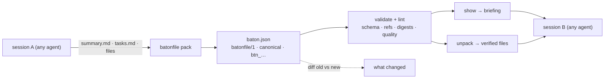

# batonfile

[English](README.md) | [中文](README.zh.md) | [日本語](README.ja.md)

[](LICENSE)   [](CONTRIBUTING.md)

**エージェント間ハンドオフのためのオープンソース交換フォーマット——会話サマリー・成果物・未完了タスクを、検証可能で diff 可能、ダイジェストで裏付けられた 1 つのバンドルに梱包する。これはバトンであり、メモリデータベースではない。**


```bash
# not yet on npm — install from a checkout of this repository
npm install && npm run build && npm pack
npm install -g ./batonfile-0.1.0.tgz
```

## なぜ batonfile？

長時間走るエージェントセッションの終わり方はいつも同じだ。コンテキストが埋まり、次のセッションに必要なものは即席の `HANDOFF.md` に走り書きされる——どんなツールも検査できない散文で、タスクはチェックボックスかどうかも怪しく、ファイル内容は誰かが切り詰めるまで貼り付けられ続ける。既存の代替は別の問題を解いている。メモリレイヤー（Mem0、Letta）はセッションを跨いで事実を永続化するが、それは SDK 付きのストアであって、コミットしてレビューできるドキュメントではない。生の transcript エクスポートはすべてを運ぶが何も伝えない。batonfile はその中間の欠けたピースだ。バージョン付きバンドルフォーマット（`batonfile/1`）と本物のバリデータ——構造化サマリー、ステータスと非循環な blocker 参照を持つタスク、受け手がバイト単位で復元できるよう SHA-256 ダイジェスト付きで埋め込まれた成果物——に加え、普段書いている markdown から baton を梱包し、ハンドオフ品質を lint し、引き継ぎブリーフィングを描画し、2 つの baton を diff してセッションが成し遂げたことを正確に示す CLI が付く。

|  | batonfile | 手書きの HANDOFF.md | transcript エクスポート | メモリレイヤー（Mem0、Letta） |
|---|---|---|---|---|
| 本来の役割 | 検証済みハンドオフバンドル | 自由形式のメモ | セッション全ログ | 長期の事実ストア |
| 機械検査可能 | スキーマ + 安定したエラーコード | 不可 | 形だけ | 検査対象のドキュメントがない |
| ファイルの運搬 | 埋め込み・sha256 検証済み | 貼り付けた断片 | インライン・未検証 | 不可 |
| タスク | ステータス、優先度、非循環 blocker | よくてチェックボックス | ターンの中に埋没 | タスクモデルではない |
| セッション間の diff | 正準形 + `diff` コマンド | 目視で読む | 非現実的 | 不可 |
| エージェント横断 | 任意の生産者・任意の消費者 | コピペ | ツール固有フォーマット | SDK とサービスにロックイン |
| ランタイムの重さ | Node、依存 0 | — | — | データベース + サービス |

<sub>各記述は各プロジェクトの公開ドキュメントに基づく（2026-07）。</sub>

## 特徴

- **慣習ではなく明文化された仕様** — `batonfile/1` の全フィールド・列挙値・上限・エラーコードは [docs/format.md](docs/format.md) に書き下されている。未知のキーはエラー、`x-` 拡張キーが逃げ道、未知のメジャーバージョンは推測せず拒否する。
- **三層バリデーション** — 構造（型、列挙、パターン）、参照（タスク id の一意性、blocker 参照、連鎖全体を出力する `blocked_by` の循環検出）、完全性（埋め込み成果物はすべてデコードでき、宣言された sha256 とバイト数に一致しなければならない）。
- **信頼できる成果物** — ファイルはダイジェストとサイズ付きで utf8 か base64 として baton 内に運ばれる。`unpack` は書き込み前に再ハッシュし、パストラバーサルを拒み、全か無かで動く。
- **セッションが既に生む出力から梱包** — `pack` は `## Goal` / `## State` サマリー markdown と GitHub 風タスクリスト（`[~]` 進行中、`[!]` ブロック、`(high)`、`(after T1)` で拡張）を読むので、ハンドオフはデータ入力作業ではなくコマンド 1 つで済む。
- **内容アドレスで diff 可能** — 正準的なフィールド順により baton は git と相性がよい。`btn_…` ダイジェストはキー順と空白は無視するがそれ以外は一切無視せず、`diff` は GNU 流の終了コードでタスク・成果物・サマリーの変化を報告する。
- **ハンドオフ品質のための lint** — パースは通るのに受け手を置き去りにする baton を 11 のルールが捕まえる：残された TODO、薄いゴール、blocker のないブロック済みタスク、失効した blocker、検証不能な成果物、肥大したバンドル。
- **ランタイム依存ゼロ、完全オフライン** — 必要なのは Node.js だけ。batonfile はローカルファイルの読み書きのみでソケットを開かず、devDependency は `typescript` ただ 1 つ。

## クイックスタート

セッションが終わった。サマリーは `summary.md` に、タスクリストは `tasks.md` にあり、持ち越す価値のあるファイルが 2 つある。baton を梱包する（このハンドオフそのものが [examples/](examples/README.md) に同梱されている）：

```bash
batonfile pack \
  --title "Fix the flaky checkout integration test" \
  --summary summary.md --tasks tasks.md \
  --artifact "patch/retry-backoff.diff:code" --artifact "notes/repro.md:doc" \
  --root session --fact branch=fix/checkout-retry --fact stub_port=9402 \
  --agent claude-code --session s-0712 \
  --created-at 2026-07-12T18:04:00Z -o ci-flake.baton.json
```

出力（実際にキャプチャした実行結果）：

```text
packed btn_a40eedf7bfc46c44 -> ci-flake.baton.json (5 task(s), 2 artifact(s), 1.1 KiB embedded)
```

次のセッションが検証して引き継ぐ（実際にキャプチャした実行結果、ブリーフィングは抜粋）：

```text
$ batonfile validate ci-flake.baton.json
ci-flake.baton.json: OK — batonfile/1, 5 task(s), 2 artifact(s), 1.1 KiB embedded, btn_a40eedf7bfc46c44

$ batonfile show ci-flake.baton.json
# Baton: Fix the flaky checkout integration test
btn_a40eedf7bfc46c44 · batonfile/1 · from claude-code (session s-0712) · 2026-07-12T18:04:00Z
...
## Tasks (1 open · 1 in progress · 1 blocked · 2 done)

- [x] T1 · Reproduce the flake locally and capture a failing run
- [x] T2 · Identify the root cause in the payment client retry loop
- [~] T3 · high · Apply the backoff patch from patch/retry-backoff.diff
- [ ] T4 · Run the integration suite 50 times to confirm the fix · (after T3)
- [!] T5 · Delete the retry workaround in deploy scripts · (after T4)
```

続いて `batonfile unpack ci-flake.baton.json --out work/` が両方の成果物をバイト単位で復元し（`sha256 ok`）、そのセッションが終わったら、後継の baton と `batonfile diff` すれば何が動いたのかが正確にわかる。

## batonfile CLI

| コマンド | 役割 | 終了コード |
|---|---|---|
| `init` | TODO プレースホルダー入りのスターター baton を書き出す | 0、既存なら 2 |
| `pack` | フラグ・markdown・ファイルから baton を構築 | 0 / 1 / 2 |
| `validate <baton>` | スキーマ・参照・内容ダイジェストを検証 | 0 有効 / 1 無効 / 2 読み取り不能 |
| `lint <baton>` | 検証 + 品質警告（`--strict` で警告も失敗扱い） | 0 / 1 / 2 |
| `show <baton>` | markdown の引き継ぎブリーフィングを stdout へ | 0 / 1 / 2 |
| `unpack <baton> --out <dir>` | ダイジェスト検証付きの成果物展開 | 0 / 1 / 2 |
| `diff <old> <new>` | 2 つの baton の間で何が変わったか | 0 同一 / 1 差分あり / 2 異常 |
| `digest <baton>` | 正準的な内容ダイジェスト `btn_…` | 0 / 1 / 2 |

CLI ができることはすべて、型付きのプログラマティック API（`validateBaton`、`createBaton`、`diffBatons` など）としてもパッケージルートからエクスポートされている。

## Lint ルール

| コード | 発火条件 |
|---|---|
| `W_PLACEHOLDER` | タイトル・サマリー・タスクに TODO/FIXME/TBD が残っている |
| `W_THIN_GOAL` / `W_THIN_STATE` | goal または state が 20 文字未満 |
| `W_NO_OPEN_TASKS` | タスクがない、または全タスク完了なのに一言もない |
| `W_BLOCKED_NO_BLOCKER` | ブロック済みタスクに blocker もメモもない |
| `W_STALE_BLOCKER` | ブロック済みタスクの blocker がすべて完了済み |
| `W_DUPLICATE_TITLE` | 正規化後のタイトルが 2 つのタスクで一致 |
| `W_UNVERIFIABLE_ARTIFACT` | 受け手が復元できない参照渡しの成果物 |
| `W_LARGE_EMBED` / `W_LARGE_BUNDLE` | 単一埋め込みが 256 KiB 超 / 合計が 1 MiB 超 |
| `W_FUTURE_TIMESTAMP` | created_at が許容スキューを超えて未来 |

## アーキテクチャ



## ロードマップ

- [x] batonfile/1 フォーマット仕様、三層バリデータ、正準ダイジェスト、品質 lint、markdown 梱包の入口、ブリーフィング/展開/diff CLI（v0.1.0）
- [ ] 並行セッション由来の baton を統合する `batonfile merge`
- [ ] 正準形に対する分離署名で、baton が生産者を証明できるように
- [ ] 一般的なセッションログ形式からサマリーを下書きする `--from-transcript` アダプター
- [ ] サードパーティ実装向けに公開可能なフォーマット適合テストベクター

全リストは [open issues](https://github.com/JaydenCJ/batonfile/issues) を参照。

## コントリビュート

コントリビュート歓迎。`npm install && npm run build` でビルドし、`npm test` と `bash scripts/smoke.sh`（`SMOKE OK` を出力すること）を実行する——このリポジトリは CI を同梱せず、上記の主張はすべてローカル実行で検証されている。[CONTRIBUTING.md](CONTRIBUTING.md) を読み、[good first issue](https://github.com/JaydenCJ/batonfile/issues?q=is%3Aissue+is%3Aopen+label%3A%22good+first+issue%22) を選ぶか、[discussion](https://github.com/JaydenCJ/batonfile/discussions) を始めてほしい。

## ライセンス

[MIT](LICENSE)
