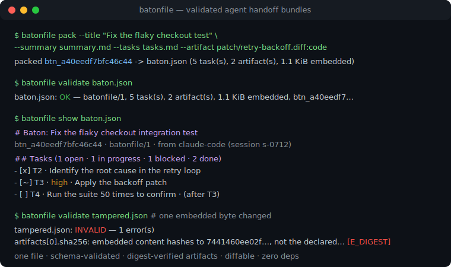
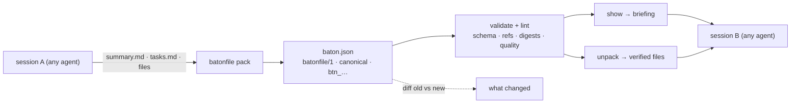

# batonfile

[English](README.md) | [中文](README.zh.md) | [日本語](README.ja.md)

[](LICENSE)   [](CONTRIBUTING.md)

**An open-source interchange format for agent handoffs — pack the conversation summary, artifacts and open tasks into one validated, diffable, digest-verified bundle; a baton, not a memory database.**



```bash
# not yet on npm — install from a checkout of this repository
npm install && npm run build && npm pack
npm install -g ./batonfile-0.1.0.tgz
```

## Why batonfile?

Every long-running agent session ends the same way: context fills up, and whatever the next session needs gets scribbled into an ad-hoc `HANDOFF.md` — prose that no tool can check, with tasks that may or may not be checkboxes and file contents pasted in until someone truncates them. The alternatives solve different problems: memory layers (Mem0, Letta) persist facts across sessions but are stores with SDKs, not documents you can commit and review; raw transcript exports carry everything and communicate nothing. batonfile is the missing piece in between: a versioned bundle format (`batonfile/1`) with a real validator — structured summary, tasks with statuses and acyclic blocker references, artifacts embedded with SHA-256 digests so the receiver reconstructs them byte-for-byte — plus a CLI that packs batons from the markdown you already write, lints them for handoff quality, renders a pickup briefing, and diffs two batons to show exactly what a session accomplished.

|  | batonfile | hand-written HANDOFF.md | transcript export | memory layers (Mem0, Letta) |
|---|---|---|---|---|
| Primary job | validated handoff bundle | free-form notes | full session log | long-term fact store |
| Machine-checkable | schema + stable error codes | no | shape only | no document to check |
| Carries files | embedded, sha256-verified | pasted snippets | inline, unverified | no |
| Tasks | statuses, priorities, acyclic blockers | checkboxes at best | buried in turns | not a task model |
| Diffable between sessions | canonical form + `diff` command | manual reading | impractical | no |
| Works across agents | any producer, any consumer | copy-paste | tool-specific format | SDK and service lock-in |
| Runtime footprint | Node, 0 dependencies | — | — | database + service |

<sub>Characterizations based on each project's public documentation, 2026-07.</sub>

## Features

- **A specified format, not a convention** — every field, enum, limit and error code of `batonfile/1` is written down in [docs/format.md](docs/format.md); unknown keys are errors, `x-` extensions are the escape hatch, and unknown major versions are refused instead of guessed at.
- **Three-layer validation** — structural (types, enums, patterns), referential (unique task ids, blocker references, `blocked_by` cycle detection that prints the full chain) and integrity (every embedded artifact must decode and match its declared sha256 and byte count).
- **Artifacts you can trust** — files are carried inside the baton as utf8 or base64 with digest and size; `unpack` re-hashes before writing, refuses path traversal, and is all-or-nothing.
- **Packs from what sessions already produce** — `pack` reads `## Goal` / `## State` summary markdown and GitHub-style task lists (extended with `[~]` in-progress, `[!]` blocked, `(high)`, `(after T1)`), so a handoff is one command, not a data-entry session.
- **Content-addressed and diffable** — canonical field order makes batons git-friendly; the `btn_…` digest ignores key order and whitespace but nothing else, and `diff` reports task, artifact and summary changes with GNU-style exit codes.
- **A lint for handoff quality** — eleven rules catch the batons that parse but strand the receiver: leftover TODOs, thin goals, blocked tasks with no blocker, stale blockers, unverifiable artifacts, bloated bundles.
- **Zero runtime dependencies, fully offline** — Node.js is the only requirement; batonfile reads and writes local files, never opens a socket, and `typescript` is the sole devDependency.

## Quickstart

A session ends. Its summary is in `summary.md`, its task list in `tasks.md`, and two files are worth carrying forward. Pack the baton (this exact handoff ships in [examples/](examples/README.md)):

```bash
batonfile pack \
  --title "Fix the flaky checkout integration test" \
  --summary summary.md --tasks tasks.md \
  --artifact "patch/retry-backoff.diff:code" --artifact "notes/repro.md:doc" \
  --root session --fact branch=fix/checkout-retry --fact stub_port=9402 \
  --agent claude-code --session s-0712 \
  --created-at 2026-07-12T18:04:00Z -o ci-flake.baton.json
```

Output (real captured run):

```text
packed btn_a40eedf7bfc46c44 -> ci-flake.baton.json (5 task(s), 2 artifact(s), 1.1 KiB embedded)
```

The next session validates and picks it up (real captured run, briefing excerpted):

```text
$ batonfile validate ci-flake.baton.json
ci-flake.baton.json: OK — batonfile/1, 5 task(s), 2 artifact(s), 1.1 KiB embedded, btn_a40eedf7bfc46c44

$ batonfile show ci-flake.baton.json
# Baton: Fix the flaky checkout integration test
btn_a40eedf7bfc46c44 · batonfile/1 · from claude-code (session s-0712) · 2026-07-12T18:04:00Z
...
## Tasks (1 open · 1 in progress · 1 blocked · 2 done)

- [x] T1 · Reproduce the flake locally and capture a failing run
- [x] T2 · Identify the root cause in the payment client retry loop
- [~] T3 · high · Apply the backoff patch from patch/retry-backoff.diff
- [ ] T4 · Run the integration suite 50 times to confirm the fix · (after T3)
- [!] T5 · Delete the retry workaround in deploy scripts · (after T4)
```

`batonfile unpack ci-flake.baton.json --out work/` then restores both artifacts byte-for-byte (`sha256 ok`), and when that session ends, `batonfile diff` against its successor baton shows exactly what moved.

## The batonfile CLI

| Command | Does | Exit codes |
|---|---|---|
| `init` | write a starter baton with TODO placeholders | 0, 2 if it exists |
| `pack` | build a baton from flags, markdown and files | 0 / 1 / 2 |
| `validate <baton>` | schema, references and content digests | 0 valid / 1 invalid / 2 unreadable |
| `lint <baton>` | validate + quality warnings (`--strict` fails on warnings) | 0 / 1 / 2 |
| `show <baton>` | markdown pickup briefing on stdout | 0 / 1 / 2 |
| `unpack <baton> --out <dir>` | digest-verified artifact extraction | 0 / 1 / 2 |
| `diff <old> <new>` | what changed between two batons | 0 same / 1 differs / 2 trouble |
| `digest <baton>` | canonical content digest `btn_…` | 0 / 1 / 2 |

Everything the CLI does is also a typed programmatic API (`validateBaton`, `createBaton`, `diffBatons`, …) exported from the package root.

## Lint rules

| Code | Fires when |
|---|---|
| `W_PLACEHOLDER` | TODO/FIXME/TBD left in title, summary or tasks |
| `W_THIN_GOAL` / `W_THIN_STATE` | goal or state under 20 characters |
| `W_NO_OPEN_TASKS` | no tasks, or every task done, with nothing said about it |
| `W_BLOCKED_NO_BLOCKER` | a blocked task names no blocker and has no notes |
| `W_STALE_BLOCKER` | every blocker of a blocked task is already done |
| `W_DUPLICATE_TITLE` | two tasks share a normalized title |
| `W_UNVERIFIABLE_ARTIFACT` | by-reference artifact the receiver cannot reconstruct |
| `W_LARGE_EMBED` / `W_LARGE_BUNDLE` | one embed over 256 KiB / total over 1 MiB |
| `W_FUTURE_TIMESTAMP` | created_at ahead of the clock beyond skew |

## Architecture



## Roadmap

- [x] batonfile/1 format spec, three-layer validator, canonical digest, quality lint, markdown pack front doors, briefing/unpack/diff CLI (v0.1.0)
- [ ] `batonfile merge` for combining batons from parallel sessions
- [ ] Detached signatures over the canonical form, so a baton can prove its producer
- [ ] `--from-transcript` adapters that draft a summary from common session-log formats
- [ ] Format conformance test vectors publishable for third-party implementations

See the [open issues](https://github.com/JaydenCJ/batonfile/issues) for the full list.

## Contributing

Contributions are welcome. Build with `npm install && npm run build`, then run `npm test` and `bash scripts/smoke.sh` (must print `SMOKE OK`) — this repository ships no CI, every claim above is verified by local runs. See [CONTRIBUTING.md](CONTRIBUTING.md), grab a [good first issue](https://github.com/JaydenCJ/batonfile/issues?q=is%3Aissue+is%3Aopen+label%3A%22good+first+issue%22), or start a [discussion](https://github.com/JaydenCJ/batonfile/discussions).

## License

[MIT](LICENSE)
