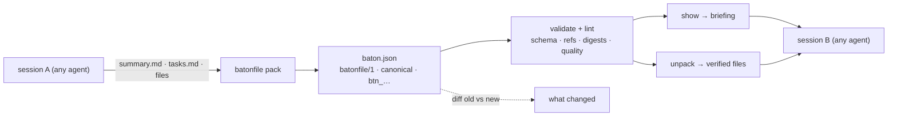

# batonfile

[English](README.md) | [中文](README.zh.md) | [日本語](README.ja.md)

[](LICENSE)   [](CONTRIBUTING.md)

**一个开源的 agent 交接（handoff）交换格式——把对话摘要、产物文件和未完成任务打包成一个可校验、可 diff、带摘要指纹的 bundle；它是一根接力棒，不是记忆数据库。**


```bash
# not yet on npm — install from a checkout of this repository
npm install && npm run build && npm pack
npm install -g ./batonfile-0.1.0.tgz
```

## 为什么选 batonfile？

每个长时间运行的 agent 会话都以同一种方式收场：上下文被填满，下一个会话需要的东西被草草写进一份临时的 `HANDOFF.md`——没有任何工具能检查的散文，任务未必是复选框，文件内容整段粘贴直到被人截断。现有替代方案解决的是别的问题：记忆层（Mem0、Letta）能跨会话持久化事实，但它们是带 SDK 的存储，不是可以提交和评审的文档；原始 transcript 导出承载一切却传达不了任何东西。batonfile 补上的正是中间缺失的那一环：一个带版本的 bundle 格式（`batonfile/1`）加真正的校验器——结构化摘要、带状态与无环 blocker 引用的任务、以 SHA-256 摘要内嵌的产物文件（接收方可逐字节重建）——再配一个 CLI，能从你本来就在写的 markdown 打包 baton、对交接质量做 lint、渲染接手简报，并 diff 两个 baton 来精确展示一个会话完成了什么。

|  | batonfile | 手写 HANDOFF.md | transcript 导出 | 记忆层（Mem0、Letta） |
|---|---|---|---|---|
| 核心职责 | 经过校验的交接 bundle | 自由格式笔记 | 完整会话日志 | 长期事实存储 |
| 机器可检查 | schema + 稳定错误码 | 否 | 仅限外形 | 没有可检查的文档 |
| 携带文件 | 内嵌且经 sha256 校验 | 粘贴的片段 | 内联且未校验 | 否 |
| 任务 | 状态、优先级、无环 blocker | 顶多是复选框 | 埋没在对话轮次里 | 不是任务模型 |
| 会话间可 diff | 规范化形式 + `diff` 命令 | 人工阅读 | 不现实 | 否 |
| 跨 agent 通用 | 任意生产者、任意消费者 | 复制粘贴 | 工具专属格式 | SDK 与服务锁定 |
| 运行时体积 | Node，0 依赖 | — | — | 数据库 + 服务 |

<sub>各项描述基于各项目的公开文档，2026-07。</sub>

## 特性

- **是成文规范，不是约定俗成** — `batonfile/1` 的每个字段、枚举、上限和错误码都写在 [docs/format.md](docs/format.md) 里；未知键会报错，`x-` 扩展键是逃生通道，未知的主版本会被拒绝而不是靠猜。
- **三层校验** — 结构层（类型、枚举、模式）、引用层（任务 id 唯一、blocker 引用、`blocked_by` 环检测并打印完整链条）与完整性层（每个内嵌产物必须能解码并匹配其声明的 sha256 和字节数）。
- **值得信任的产物文件** — 文件以 utf8 或 base64 连同摘要和大小一起装进 baton；`unpack` 写入前重新哈希、拒绝路径穿越，并且要么全成要么全不写。
- **直接打包会话已有的产出** — `pack` 读取 `## Goal` / `## State` 摘要 markdown 和 GitHub 风格任务列表（扩展了 `[~]` 进行中、`[!]` 阻塞、`(high)`、`(after T1)`），交接只需一条命令，而不是一场数据录入。
- **内容寻址且可 diff** — 规范化的字段顺序让 baton 对 git 友好；`btn_…` 摘要忽略键序和空白但不忽略其他任何东西，`diff` 以 GNU 风格退出码报告任务、产物和摘要的变化。
- **面向交接质量的 lint** — 十一条规则专抓那些能通过解析却会把接收者晾在原地的 baton：残留的 TODO、单薄的目标、没有 blocker 的阻塞任务、失效的 blocker、无法验证的产物、臃肿的 bundle。
- **零运行时依赖，完全离线** — 只需要 Node.js；batonfile 只读写本地文件、从不打开 socket，`typescript` 是唯一的 devDependency。

## 快速上手

一个会话结束了。它的摘要在 `summary.md`，任务列表在 `tasks.md`，还有两个值得带走的文件。打包 baton（这份交接原样收录在 [examples/](examples/README.md)）：

```bash
batonfile pack \
  --title "Fix the flaky checkout integration test" \
  --summary summary.md --tasks tasks.md \
  --artifact "patch/retry-backoff.diff:code" --artifact "notes/repro.md:doc" \
  --root session --fact branch=fix/checkout-retry --fact stub_port=9402 \
  --agent claude-code --session s-0712 \
  --created-at 2026-07-12T18:04:00Z -o ci-flake.baton.json
```

输出（真实捕获的运行结果）：

```text
packed btn_a40eedf7bfc46c44 -> ci-flake.baton.json (5 task(s), 2 artifact(s), 1.1 KiB embedded)
```

下一个会话校验并接手它（真实捕获的运行结果，简报节选）：

```text
$ batonfile validate ci-flake.baton.json
ci-flake.baton.json: OK — batonfile/1, 5 task(s), 2 artifact(s), 1.1 KiB embedded, btn_a40eedf7bfc46c44

$ batonfile show ci-flake.baton.json
# Baton: Fix the flaky checkout integration test
btn_a40eedf7bfc46c44 · batonfile/1 · from claude-code (session s-0712) · 2026-07-12T18:04:00Z
...
## Tasks (1 open · 1 in progress · 1 blocked · 2 done)

- [x] T1 · Reproduce the flake locally and capture a failing run
- [x] T2 · Identify the root cause in the payment client retry loop
- [~] T3 · high · Apply the backoff patch from patch/retry-backoff.diff
- [ ] T4 · Run the integration suite 50 times to confirm the fix · (after T3)
- [!] T5 · Delete the retry workaround in deploy scripts · (after T4)
```

随后 `batonfile unpack ci-flake.baton.json --out work/` 会逐字节还原两个产物文件（`sha256 ok`）；等这个会话也结束时，用 `batonfile diff` 对比它的后继 baton，就能看到究竟推进了什么。

## batonfile CLI

| 命令 | 作用 | 退出码 |
|---|---|---|
| `init` | 写出一个带 TODO 占位符的起步 baton | 0，已存在则 2 |
| `pack` | 从命令行参数、markdown 和文件构建 baton | 0 / 1 / 2 |
| `validate <baton>` | 校验 schema、引用和内容摘要 | 0 有效 / 1 无效 / 2 不可读 |
| `lint <baton>` | 校验 + 质量警告（`--strict` 时警告即失败） | 0 / 1 / 2 |
| `show <baton>` | 向 stdout 输出 markdown 接手简报 | 0 / 1 / 2 |
| `unpack <baton> --out <dir>` | 经摘要校验的产物提取 | 0 / 1 / 2 |
| `diff <old> <new>` | 两个 baton 之间发生了什么变化 | 0 相同 / 1 有差异 / 2 出错 |
| `digest <baton>` | 规范化内容摘要 `btn_…` | 0 / 1 / 2 |

CLI 能做的一切也都以带类型的编程 API 形式（`validateBaton`、`createBaton`、`diffBatons` 等）从包根导出。

## Lint 规则

| 代码 | 触发条件 |
|---|---|
| `W_PLACEHOLDER` | 标题、摘要或任务里残留 TODO/FIXME/TBD |
| `W_THIN_GOAL` / `W_THIN_STATE` | goal 或 state 少于 20 个字符 |
| `W_NO_OPEN_TASKS` | 没有任务，或所有任务已完成却只字未提 |
| `W_BLOCKED_NO_BLOCKER` | 阻塞任务既没写 blocker 也没写备注 |
| `W_STALE_BLOCKER` | 阻塞任务的所有 blocker 都已完成 |
| `W_DUPLICATE_TITLE` | 两个任务归一化后标题相同 |
| `W_UNVERIFIABLE_ARTIFACT` | 接收方无法重建的按引用产物 |
| `W_LARGE_EMBED` / `W_LARGE_BUNDLE` | 单个内嵌超过 256 KiB / 总量超过 1 MiB |
| `W_FUTURE_TIMESTAMP` | created_at 超出时钟偏移容差、指向未来 |

## 架构



## 路线图

- [x] batonfile/1 格式规范、三层校验器、规范化摘要、质量 lint、markdown 打包入口、简报/解包/diff CLI（v0.1.0）
- [ ] `batonfile merge`，用于合并来自并行会话的 baton
- [ ] 对规范化形式的分离签名，让 baton 能证明其生产者
- [ ] `--from-transcript` 适配器，从常见会话日志格式起草摘要
- [ ] 可发布的格式一致性测试向量，供第三方实现使用

完整列表见 [open issues](https://github.com/JaydenCJ/batonfile/issues)。

## 参与贡献

欢迎贡献。用 `npm install && npm run build` 构建，然后运行 `npm test` 和 `bash scripts/smoke.sh`（必须打印 `SMOKE OK`）——本仓库不附带 CI，上文的每一条声明都由本地运行验证。参阅 [CONTRIBUTING.md](CONTRIBUTING.md)，认领一个 [good first issue](https://github.com/JaydenCJ/batonfile/issues?q=is%3Aissue+is%3Aopen+label%3A%22good+first+issue%22)，或发起一个 [discussion](https://github.com/JaydenCJ/batonfile/discussions)。

## 许可证

[MIT](LICENSE)
